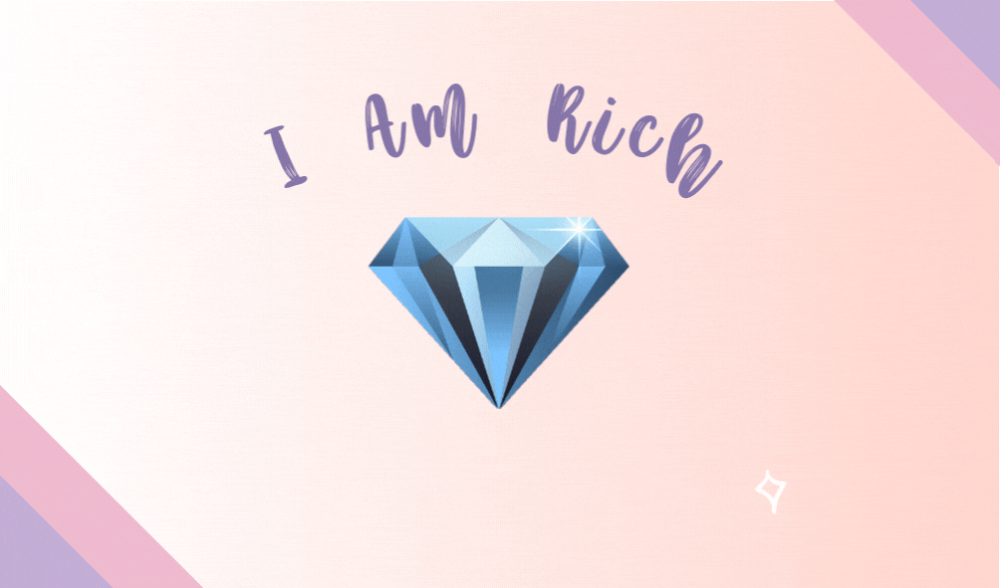
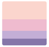

# iOS & Swift - The Complete iOS App Development Bootcamp
* [iOS & Swift - The Complete iOS App Development Bootcamp | Udemy](https://www.udemy.com/course/ios-13-app-development-bootcamp/)
* [Dr. Angela Yu | Developer and Lead Instructor| Udemy](https://www.udemy.com/user/4b4368a3-b5c8-4529-aa65-2056ec31f37e/)
* **Important links for the course:** [iOS Course Resources | The App Brewery](https://www.appbrewery.co/p/ios-course-resources)

## Section 2: Xcode Storyboards and Interface Builder

### About the color palette:

[Pastel Color Palettes - Color Hunt](https://colorhunt.co/palettes/pastel)
* #FFD5CD
* #EFBBCF
* #C3AED6
* #8675A9

### About iPhone Resolutions:
* [The Ultimate Guide To iPhone Resolutions](https://www.paintcodeapp.com/news/ultimate-guide-to-iphone-resolutions)
* [App Icon Generator](https://appicon.co/)
